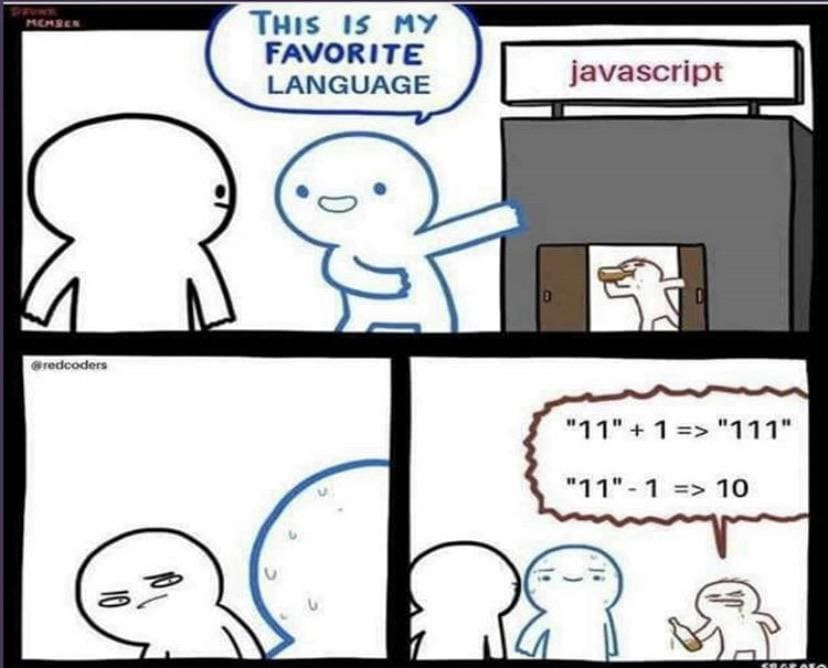

[9장] 타입 변환과 단축 평가
===
# 9.1 타입 변환이란?
- 명시적 타입 변환(타입 캐스팅) : 개발자의 의도에 따라 값의 타입을 변환하는 것
- 암묵적 타입 변환(타입 강제 변환) : 개발자의 의도와는 상관 없이 자바스크립트 엔진에 의해 암묵적으로 타입이 자동 변환되는 것.
### [09-01] 명시적 타입 변환
```js
var x = 10;
var str = x.toString();
console.log(typeof str, str); //string 10

console.log(typeof x, x) //number 10
```
### [09-02] 암묵적 타입 변환
```js
var x = 10;
var str = x + '';
console.log(typeof str, str); //string 10
console.log(typeof x,x); //number 10
```
- 명시적 타입 변환이나 암묵적 타입 변환이 기존 원시 값(위의 경우 x의 값)을 직접 변경하는 것은 아니다.
- 타입 변환이란, 기존 원시 값을 사용해 다른 타입의 새로운 원시 값을 생성하는 것이다.

# 9.2 암묵적 타입 변환
## 9.2.1 문자열 타입으로 변환
### [09-04]
```js
1 + '2' // '12'
```
- 문자열 연결 연산자 표현식을 평가하기 위해서 문자열이 아닌 피연자의 타입을 문자열로 변환하였다.

### [09-05]
```js
`1+1 = ${1+1}` // "1+1 = 2"
```
- 템플릿 리터럴의 표현식 삽입은 표현식 평가 결과를 문자열 타입으로 암묵적으로 변환한다. 
## 9.2.2 숫자 타입으로 변환
### [09-07]
```js
1 - '1' // 0
1 * '10' // 10
1 / 'one' // NaN
```
- 산술 연산자의 모든 피연산자는 모두 숫자 타입이어야 한다.
- 숫자 타입이 아닌 피연산자를 숫자 타입으로 암묵적 타입 변환 한다.
- 숫자 타입으로 변환될 수 없는 경우 연산을 수행할 수 없어 펑가 결과는 NaN이 된다.

🧐

</img><br/>
- +를 문자열 연결 연산자로 생각하여, 1을 '1'로 타입 변환하여 평가 -> '11'+'1' => '111'
- -는 산술 연산자이기 때문에, '11'을 11로 변환하여 평가 => 11 - 1 -> 10 
### [09-08]
```JS
'1' > 0 // true
```
- 비교 연산자의 모든 피연산자는 숫자 타입이어야 한다.
- 빈 문자열(''), 빈 배열([]), null, false는 0으로, true는 1로 변환한다. 
- 객체, 빈 배열이 아닌 배열, undefined는 변환되지 않아 NaN

## 9.2.3 불리언 타입으로 변환
- 자바스크립트 엔진은 불리언 타입이 아닌 값을 Truthy 값, Falsy 값으로 구분한다. 

__Falsy 값__
- false
- undefined
- null
- 0, -0
- NaN
- '' (빈 문자열)

__Truthy 값__
- Falsy 값 이외의 모든 값은 true로 평가 된다.

__Truthy/Falsy 판별하는 함수__
```
isFalsy();
isTruthy();
```
# 9.3 명시적 타입 변환
## 9.3.1 문자열 타입으로 변환
- 문자열 타입이 아닌 값을 문자열 타입으로 변환하는 방법
1. String 생성자 함수를 new 연산자 없이 호출
2. Object.prototype.toString 메서드를 사용
3. 문자열 연결 연산자를 이용
```js
//1. String 생성자 함수를 new 연산자 없이 호출
// 숫자 타입 => 문자열 타입
String(1); //'1'
String(NaN); //'NaN'

// 불리언 타입 => 문자열 타입
String(true); // 'true;

//2. Object.prototype.toString  메서드를 사용하는 방법
// 숫자 타입 => 문자열 타입
(1).toString(); //'1'
(NaN).toString(); //'NaN'

// 불리언 타입 => 문자열 타입
(true).toString(); //'true'

//3.문자열 연결 연산자를 이용하는 방법
//숫자 타입 => 문자열 타입
1 + ''; // '1'
NaN + ''; // 'NaN'

//불리언 타입 => 문자열 타입
true +''; //'true;
```

## 9.3.2 숫자 타입으로 변환
- 숫자 타입이 아닌 값을 숫자 타입으로 변환하는 방법
1. Number 생성자 함수를 new 연산자 없이 호출하는 방법
2. parseInt, parseFloat 함수를 사용하는 방법(문자열만 가능)
3. '+' 단항 산술 연산자를 이용하는 방법
4. '*' 산술 연산자를 이용하는 방법

```js
// 1. Number 생성자 함수를 new 연산자 없이 호출하는 방법
// 문자열 타입 => 숫자 타입
Number('0'); //0
Number('-1'); //-1

//불리언 타입 => 숫자 타입 
Number(true); // 1
Number(false); //0

// 2. parseInt, parseFloat 함수를 사용하는 방법
parseInt('0'); // 0
parseInt('-1'); //-1
parseInt('10.53'); //10
parseFloat('10.53'); // 10.53

// 3. +단항 산술 연산자를 이용하는 방법
// 문자열 타입 => 숫자 타입
+'0'; // 0
+'-1'; // -1

//불리언 타입 => 숫자 타입
+true; //1
+false; //0

// 4. * 산술 연산자를 이용하는 방법
// 문자열 타입 => 숫자 타입
'0' * 1; // 0
'-1' * 1; // -1

//불리언 타입 => 숫자 타입
true * 1; // 1
false * 1; // 0
```

## 9.3.3 불리언 타입으로 변환
- 불리언 타입이 아닌 값을 불리언 타입으로 변환하는 방법
1. Boolean 생성자 함수를 new 연산자 없이 호출하는 방법
2. ! 부정 논리 연산자를 두 번 사용하는 방법
```js
//1. Boolean 생성자 함수를 new 연산자 없이 호출하는 방법
//문자열 타입 => 불리언 타입
Boolean('x'); // true
Boolean(''); //false
Boolean('false') //true

//숫자 타입 => 불리언 타입
Boolean(0); // false
Boolean(1); //true
Boolean(4); //true
Boolean(NaN); // false
Boolean(Infinity); //true

//null 타입 => 불리언 타입
Boolean(null); // false
//undefined 타입 => 불리언 타입
Boolean(undefined); //false

//객체 타입 => 불리언 타입
Boolean({}); //true
Boolean([]); //true

// 2. 부정 논리 연산자를 두 번 사용하는 방법
//문자열 타입 => 숫자 타입
!!'x'; //true
!!''; //false
!!'false' // true

// 숫자 타입 => 불리언 타입
!!0; //false
!!1; //true
!!NaN; //false
!!Infinity; //true

//이하 생략
```

# 9.4 단축 평가
## 9.4.1 논리 연산자를 사용한 단축 평가
### [09-17]
```js
'Cat' && 'Dog' // 'Dog'
```
- 첫 번째 피연산자는 Truthy 값이므로 true이다.
- 논리곱(&&)은 두 피연산자 모두 true여야 true로 평가된다
- 즉, 두 번째 피연산자가 평가 결과를 결정한다
- 논리곱 연산자는 논리 연산의 결과를 결정하는 두 번째 피연산자를 그대로 반환한다.

### [09-18]
```js
'Cat' || 'Dog' // 'Cat'
```
- 논리합(||) 연산자는 하나만 true로 평가되어도 true를 반환한다.
- 첫 번째 피연산자가 Truthy 값이므로 true로 평가된다.
- 논리 연산의 결과를 결정한 첫 번째 피연산자가 그대로 반환된다. 

__단축 평가(short-circuit evaluation)__

- 논리 연산의 결과를 결정하는 피연산자를 타입 변환하지 않고 그대로 반환하는 것. 
- 단축 평가는 표현식을 평가하는 도중에 평가 결과가 확정되면 나머지 평가를 생략한다. 


### [09-20] &&(논리곱)의 if문 대체
```js
var done = true;
var message = '';

if (done) message = '완료';

//done이 true라면 '완료'가 message에 할당
message = done && '완료' ;
console.log(message); // '완료'
```
- done이 true(truthy)라면 &&의 우항까지 평가할 것
- 우항이 논리 연산의 결과를 결정하므로 우항이 반환
- 어떤 조건이 Truthy 값일 때 무언가를 해야한다면 논리곱(&&) 연산자 표현식으로 if문을 대체할 수 있다.

### [09-21] ||(논리합)의 if문 대체
```js
var done = false;
var message = '';

if (done) message = '미완료';

//done이 false라면 '미완료'가 message에 할당
message = done || '미완료' ;
console.log(message); // '미완료'
```
- done이 false(falsy)라면, ||의 우항까지 평가할 것.
- 우항이 논리 연산의 결과를 결정하므로 우항이 반환
- 어떤 조건이 Falsy 값일 때 무언가를 해야한다면 논리합(||) 연산자 표현식으로 if 문을 대체할 수 있다.

### [09-23] 객체를 가리키기를 기대하는 변수가 null 또는 undefined가 아닌지 확인할 때
```js
var elem = null;

var value = elem.value; //TypeError
```
- 객체를 가리키기를 기대하는 변수의 값이 객체가 아니라 null 또는 undefined인 경우. 객체의 프로퍼티를 참조하면 타입 에러가 발생한다.

### [09-24]
```js
var elem = null;

var value = elem && elem.value;
console.log(value) // null
```
- elem이 Falsy 값이기 때문에, elem만 평가되어 null 반환
- elem이 Truthy 값이었다면, elem.value로 평가되었을 것. 
( => 9.4.2 옵셔널 체이닝 연산자 를 통해서도 할 수 있음)

### [09-25] 함수 매개변수에 기본값을 설정할 때
- 함수를 호출할 때 인수를 전달하지 않으면 매개변수에는 undefined가 할당된다. 
- 단축 평가를 사용해서 매개변수의 기본값을 설정하여 undefined로 인해 발생할 수 있는 에러를 방지할 수 있다.
### [09-25]
```js
//매개변수의 기본값을 설정하지 않고 인수를 전달하지 않았을 때 TypeError
function getStringLength(str) {
    return str.length;
}

getStringLength(); //TypeError: Cannot read properties of undefined (reading 'length')

//단축 평가를 사용한 매개변수의 기본값 설정
function getStringLength(str) {
    str = str || '';
    return str.length;
}

getStringLength(); // 0
getStringLength('hi'); // 2

//ES6의 매개변수의 기본값 설정
function getStringLength(str = '') {
    return str.length;
}
getStringLength(); // 0
getStringLength('hi'); // 2
```

## 9.4.2 옵셔널 체이닝(optional chaining) 연산자
?. : 좌항의 피연산자가 null 또는 undefined면 undefined를 반환하고, 그렇지 않으면 우항의 프로퍼티 참조를 이어간다. 

### [09-26]
```js
var elem = null;
var value = elem?.value;
console.log(value); //undefined
```
- 좌항의 피연산자가 null 이므로 undefined를 반환함.
- 객체를 가리키기를 기대하는 변수가 null 또는 undefined가 아닌지 확인하고 프로퍼티를 참조할 때 유용.
- ?.(옵셔널 체이닝 연산자) 도입 이전에는 논리 연산자 &&를 사용한 단축평가를 통해 변수가 null인지 undefined인지 확인했음(예제[09-24])
- ?.(옵셔널 체이닝 연산자)는 좌항의 피연산자가 Falsy값이라도 null 또는 undefined가 아니면 우항의 프로퍼티 참조를 이어간다.
### [09-28~29]
```js
//빈문자열 ''은 Falsy 값
var str = '';
//좌항이 Falsy이기 때문에 str의 값을 반환한다. 
var length = str && str.length;
length; // ''

//str이 Falsy값이라도 null 혹은 undefined가 아니기 때문에 우항의 프로퍼티를 참조
length = str?.length;
length; //0
```

## 9.4.3 null 병합 연산자
- ?? (null 병합 연산자)는 좌항의 피연산자가 null 또는 undefined인 경우 우항의 피연산자를 반환하고, 그렇지 않으면 좌항의 피연산자를 반환한다.
- ??는 변수에 기본값을 설정할 때 유용하다

### [09-30]
```js
var foo = null ?? 'default string';
console.log(foo); // 'default string'
```

### [09-31]
```js
var foo = '' || 'default string';
console.log(foo); // 'default string'
```
- 논리 연산자 || 를 사용한 단축평가를 통해서도 기본값 설정 가능
- 0이나 ''의 경우 Falsy한 값이기 때문에, 이 값들도 기본값으로서 유효하다면 예기치 않은 에러가 발생할 수 있다. (-> null 병합 연산자 사용)
### [09-32]
```js
var foo = '' ?? 'default string';
console.log(foo); // ''
```
- 좌항의 피연산자가 Falsy 값이더라도 null 또는 undefined가 아니면 좌항의 피연산자를 반환한다. 

