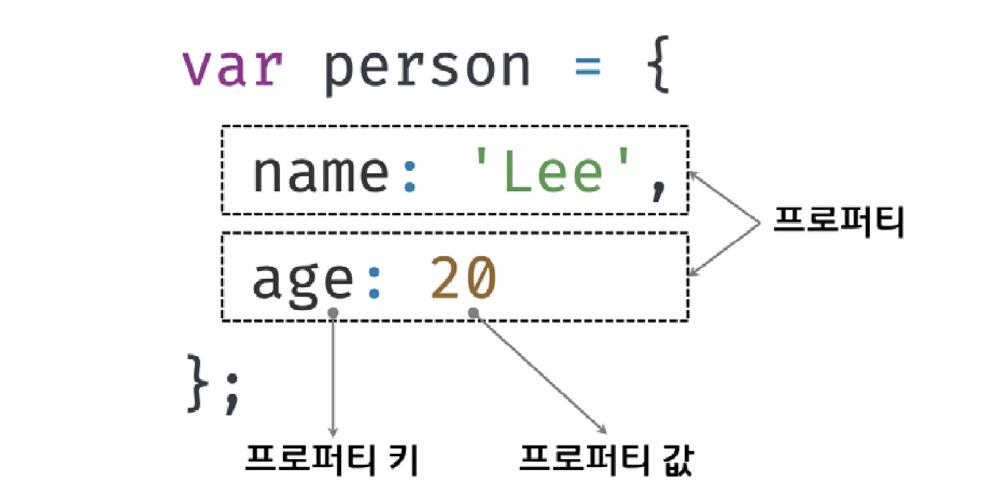
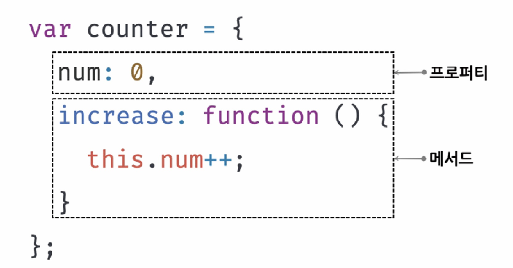

# [10장] 객체 리터럴

# 10.1 객체(Object)란?

</img><br/>

</img><br/>
-   자바스크립트는 객체 기반의 프로그래밍 언어
-   원시 값을 제외한 나머지 값(함수, 배열, 정규 표현식 등)은 모두 객체
-   원시 타입의 값과 다르게 변경 가능한 값이다.
-   객체는 0개 이상의 프로퍼티로 구성된 집합이다.
-   프로퍼티는 프로퍼티 키와 프로퍼티 값으로 구성된다.
-   프로퍼티 값이 함수일 경우, 메서드(method)라고 부른다.

# 10.2 객체 리터럴에 의한 객체 생성
객체 생성하는 방법
1. 객체 리터럴
2. Object 생성자 함수
3. 생성자 함수
4. Object.create 메서드
5. 클래스

### [10-01]

```js
var person = {
    name : 'Kim'
    sayHello : function(){
        console.log(`Hello! My name is ${this.name}`);
    }
};

console.log(typeof person); // object
console.log(person); // {name : 'Kim', sayHello : f}
```

-   객체 리터럴은 중괄호({}) 내에 0개 이상의 프로퍼티를 정의한다.
-   변수에 할당되는 시점에 엔진은 객체 리터럴을 해석해 객체를 생성한다.
-   객체 리터럴의 중괄호는 코드 블록을 의미하지 않는다.
-   객체 리터럴은 값으로 평가 받는 표현식이므로 중괄호 뒤에는 세미콜론을 붙여야 한다.

# 10.3 프로퍼티(property)

-   객체는 프로퍼티의 집합이며, 프로퍼티는 키와 값으로 구성된다.
-   프로퍼티를 나열할 때는 , 로 구분한다.
-   프로퍼티 키 : 프로퍼티 값에 접근할 수 있는 이름으로서 식별자 역할
-   프로퍼티 키가 식별자 네이밍 규칙을 준수한다면 따옴표로 감싸지 않아도 된다.
-   네이밍 규칙을 따르지 않는다면, 문자열이므로 따옴표를 사용해야 한다.
### [10-04]
```js
var person = {
    firstName: 'cy',
    'last-name': 'Kim'
};
```
- '-'가 있기 때문에 따옴표를 사용해야 한다.

### [10-06] 프로퍼티 키 동적 생성
```js
var obj = {};
var key = 'hello';

//ES5 : 프로퍼티 키 동적 생성(10.7)
obj[key] = 'world';

//이렇게도 쓸 수 있다
//ES6 : 계산된 프로퍼티 이름 (10.9.2 에서 후술)
// var obj = { [key] : 'world'};

console.log(obj); // {hello : 'world'}
```
- [ ]를 이용해서 객체의 변수명에 미리 계산된 변수를 넣는 것이 가능하다.

### [10-08]
```js
var foo = {
    0: 1,
    1: 2,
    2: 3
};
console.log(foo); // {0: 1, 1: 2, 2: 3}
```
- 프로퍼티 키에 문자열이나 심벌 값 이외의 값을 사용하면, 암묵적 타입 변환을 통해 문자열이 된다.
- 숫자 리터럴을 프로퍼티 키로 사용하면 따옴표는 붙지 않지만 내부적으로는 문자열로 변환한다.

# 10.4 메서드(method)
- 프로퍼티 값이 함수일 경우 메서드라 부른다.
### [10-11]
```js
var circle = {
    radius: 5,
    getDiameter: function() { //메서드
        return 2 * this.radius;
    }
};
console.log(circle.getDiameter()); //10
```

# 10.5 프로퍼티 접근
1. 마침표 표기법(dot notation) : 마침표 프로퍼티 접근 연산자(.)를 사용하여 접근
2. 대괄호 표기법(bracket notation) : 대괄호 프로퍼티 접근 연산자([])를 사용하여 접근

### [10-12]
```js
var person = {
    name : 'Kim'
};

console.log(person.name); // Kim

console.log(person['name']); //Kim
```
- 마침표 표기법 : 객체.프로퍼티키
- 대괄호 표기법 : 객체['프로퍼티키'] 
- 대활호 프로퍼티 접근 연산자 내부에서 프로퍼티 키는 반드시 따옴표로 감싸야 한다.
### [10-15]
```js
var person = {
    'last-name' : 'Kim'
};

person.last-name; //NaN
person['last-name']; // Kim
```
- 자바스크립트에서 사용 가능한 유효한 이름이 아니면 반드시 대괄호 표기법을 사용해야 한다. 

# 10.6 프로퍼티 값 갱신
- 이미 존재하는 프로퍼티에 값을 할당하면 프로퍼티 값이 갱신된다.

```js
var person = {
    name: 'Kim'
};

person.name = 'Lee';

console.log(person); // {name : 'Lee'}
```

# 10.7 프로퍼티 동적 생성
- 존재하지 않는 프로퍼티에 값을 할당하면 프로퍼티가 동적으로 생성되어 추가되고 프로퍼티 값이 할당된다. 
```js
var person ={
    name: 'Kim'
};
//프로퍼티 동적 생성
person.age = 20;

console.log(person); // {name: 'Kim', age: 20}
```

# 10.8 프로퍼티 삭제 
- delete 연산자는 객체의 프로퍼티를 삭제한다.
- 존재하지 않는 프로퍼티를 삭제하면 에러 없이 무시된다.

```js
var person ={
    name: 'Kim'
};
//프로퍼티 동적 생성
person.age = 20;

delete person.age;

console.log(person); // {name: 'Kim'}
```
# 10.9 ES6에서 추가된 객체 리터럴의 확장 기능
## 10.9.1 프로퍼티 축약 기능
- 프로퍼티 값으로 변수를 사용하는 경우, 변수 이름과 프로퍼티 키가 동일한 이름일 때, 프로퍼티 키를 생략할 수 있다. 
### [10-19]
```JS
//ES5
var x = 1, y = 2;

var obj = {
    x: x.
    y: y
};

console.log(obj); // { x: 1, y: 2}
```
### [10-20]
```JS
//ES6
let x = 1, y = 2;

const obj = { x , y };
console.log(obj); // { x: 1, y: 2}
```
- 변수를 객체의 프로퍼티로써 사용하면, 변수의 이름 그대로 프로퍼티 키로 사용할 수 있다. 

## 10.9.2 계산된 프로퍼티 이름
- 프로퍼티 키를 동적으로 생성할 때 표현식을 대괄호([])로 묶어야 한다.
- 이를 계산된 프로퍼티 이름(computed property name)이라 한다.
### [10-21] ES5
```js
var prefix = 'prop';
var i = 0;

var obj = {};

// 계산된 프로퍼티 이름으로 프로퍼티 키를 동적생성 한다. 
// ES5 예제라서 템플릿 리터럴 방식을 사용하지 않은 듯함
obj[prefix + '-' + ++i] = i;
obj[prefix + '-' + ++i] = i;
obj[prefix + '-' + ++i] = i;

console.log(obj); // {prop-1: 1, prop-2: 2, prop-3, 3}
```
- ES5 에서 계산된 프로퍼티 이름으로 프로퍼티 키를 동적 생성하기 위해서는, 객체 리터럴 외부에서 대괄호([]) 표기법을 사용해야했다.

### [10-22] ES6
```JS
const prefix = 'prop';
let i = 0;

const obj = {
    [`${prefix}-${++i}`]: i,
    [`${prefix}-${++i}`]: i,
    [`${prefix}-${++i}`]: i
};

console.log(obj); //{prop-1: 1, prop-2: 2, prop-3: 3}
```
- ES6 에서는 객체 리터럴 내부에서도 계산된 프로퍼티 이름으로 프로퍼티 키를 동적 생성할 수 있다. 

## 10.9.3 메서드 축약 표현
- ES5 : 메서드를 정의하려면 프로퍼티 값으로 함수를 할당한다.
### [10-23]
```JS
var obj = {
    name: 'Kim',
    sayHi: function(){
        console.log('Hi! '+this.name);
    }
};
obj.sayHi(); //Hi! Kim
```
- ES6 : 메서드를 정의할 때 function 키워드를 생략한 축약 표현을 사용할 수 있다.
### [10-24]
```js
var obj = {
    name: 'Kim',
    sayHi() {
        console.log('Hi! '+this.name);
    }
};
obj.sayHi(); //Hi! Kim
```
- 메서드 축약 표현으로 정의한 메서드는 프로퍼티에 할당한 함수와 다르게 동작한다. (26.2절 '메서드'에서 후술)