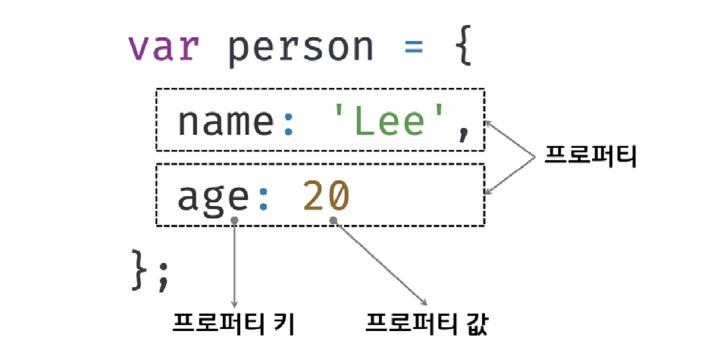
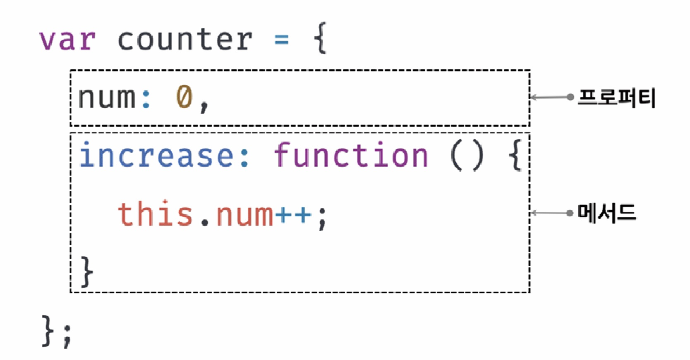

# [10장] 객체 리터럴

# 10.1 객체(Object)란?
</img><br/>
</img><br/>
-   자바스크립트는 객체 기반의 프로그래밍 언어
-   원시 값을 제외한 나머지 값(함수, 배열, 정규 표현식 등)은 모두 객체
-   원시 타입의 값과 다르게 변경 가능한 값이다.
-   객체는 0개 이상의 프로퍼티로 구성된 집합이다.
-   프로퍼티는 프로퍼티 키와 프로퍼티 값으로 구성된다.
-   프로퍼티 값이 함수일 경우, 메서드(method)라고 부른다.

# 10.2 객체 리터럴에 의한 객체 생성

1. 객체 리터럴
2. Object 생성자 함수
3. 생성자 함수
4. Object.create 메서드
5. 클래스
   위의 다섯가지 방법으로 객체를 생성할 수 있다.

### [10-01]

```js
var person = {
    name : 'Kim'
    sayHello : function(){
        console.log(`Hello! My name is ${this.name}`);
    }
};

console.log(typeof person); // object
console.log(person); // {name : 'Kim', sayHello : f}
```

-   객체 리터럴은 중괄호({}) 내에 0개 이상의 프로퍼티를 정의한다.
-   변수에 할당되는 시점에 엔진은 객체 리터럴을 해석해 객체를 생성한다.
-   객체 리터럴의 중괄호는 코드 블록을 의미하지 않는다.
-   객체 리터럴은 값으로 평가 받는 표현식이므로 중괄호 뒤에는 세미콜론을 붙여야 한다.

# 10.3 프로퍼티(property)

-   객체는 프로퍼티의 집합이며, 프로퍼티는 키와 값으로 구성된다.
-   프로퍼티를 나열할 때는 , 로 구분한다.
-   프로퍼티 키 : 프로퍼티 값에 접근할 수 있는 이름으로서 식별자 역할
-   프로퍼티 키가 식별자 네이밍 규칙을 준수한다면 따옴표로 감싸지 않아도 된다.
-   네이밍 규칙을 따르지 않는다면, 문자열이므로 따옴표를 사용해야 한다.
### [10-04]
```js
var person = {
    firstName: 'cy',
    'last-name': 'Kim'
};
```
- '-'가 있기 때문에 따옴표를 사용해야 한다.

### [10-06]
```js
var obj = {};
var key = 'hello';

//프로퍼티 키 동적 생성
obj[key] = 'world';
//계산된 프로퍼티 이름
// var obj = { [key] : 'world'};

console.log(obj); // {hello : 'world'}
```
- [ ]를 이용해서 객체의 변수명에 미리 계산된 변수를 넣는 것이 가능하다.

### [10-08]
```js
var foo = {
    0: 1,
    1: 2,
    2: 3
};
console.log(foo); // {0: 1, 1: 2, 2: 3}
```
- 프로퍼티 키에 문자열이나 심벌 값 이외의 값을 사용하면, 암묵적 타입 변환을 통해 문자열이 된다.
- 숫자 리터럴을 프로퍼티 키로 사용하면 따옴표는 붙지 않지만 내부적으로는 문자열로 변환한다.
