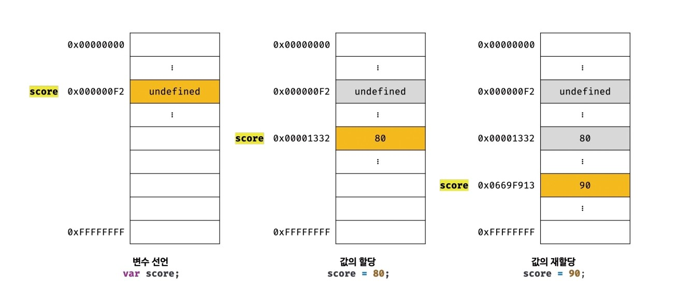
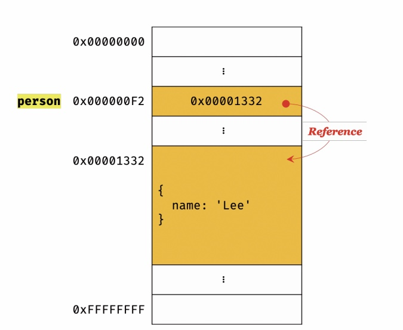

[11장] 원시 값과 객체의 비교
===
1. 원시 타입 값,원시 값 
- 변경 불가능한 값 (immutable value)
- 변수에 할당하면 변수(확보된 메모리 공간)에는 실제 값이 저장됨
- 원시 값을 갖는 변수를 다른 변수에 할당 시 원본의 원시 값이 복사되어 전달됨 ; 값에 의한 전달 (pass by value)

2. 객체(참조) 타입 값, 객체 값
- 변경 가능한 값(mutable value)
- 변수에 할당하면 변수(확보된 메모리 공간)에는 참조 값이 저장됨
- 객체를 가리키는 변수를 다른 변수에 할당하면 원본의 참조 값이 복사되어 전달됨 ; 참조에 의한 전달 (pass by reference)

⚠ 
- 변수 : 하나의 값을 저장하기 위해 확보한 메모리 공간 자체 또는 그 메모리 공간을 식별하기 위해 붙인 이름
- 값 : 변수에 저장된 데이터
- 변경 불가능한 것은 변수가 아니라 __값__ 이다.

# 11.1 원시 값
## 11.1.1 변경 불가능한 값
- 원시 값은 읽기 전용 값으로서 변경할 수 없다.
- 변수가 아닌 __원시 값__ 자체를 변경할 수 없다는 뜻. 
- 변수는 재할당을 통해 변수 값을 변경할 수 있다.
- 원시 값을 할당한 변수를 참조하면 메모리에 저장되어 있는 원시 값에 접근한다
</img><br/>
- 원시 값을 할당한 변수에 새로운 원시 값을 재할당하면, 메모리 공간에 저장되어 있는 재할당 이전의 원시 값이 변경되는 것이 아님
- 새로운 메모리 공간을 확보하고 재할당 원시 값을 저장한 후, 변수가 참조하는 메모리 공간의 주소가 바뀌는 것. 
- 이러한 특성을 불변성(immutability)이라 함. 

## 11.1.2 문자열과 불변성
- 문자열은 문자의 개수에 따라 필요한 공간의 크기가 결정됨.
- 숫자 값은 숫자의 크기에 상관없이 동일한 8바이트가 필요함.
- 문자열은 1개의 문자 당 2바이트가 필요하다
- 문자열은 원시 타입이며, 변경 불가능 하다. 
### [10-03]
``` js
var str = 'Hello';
str = 'world';
```
- 이 때 문자열 'Hello'와 'World'는 모두 메모리에 존재
- 식별자 str이 가리키는 문자열이 달라진 것. 

### [10-04]
```js
var str = 'string';
//문자열은 유사 배열이므로 배열과 유사하게 인덱스를 사용해 각 문자에 접근할 수 있다. 
//하지만 문자열은 원시 값이므로 변경할 수 없다. 이때 에러가 발생하진 않는다
str[0] = 'S';

console.log(str); //string
```
- 이미 생성된 문자열의 일부 문자를 변경해도, 문자열은 원시 값이기 때문에 변경 불가능 하여 반영되지 않는다. 
- 변수에 새로운 문자열을 재할당 하는 것만 가능. (`var str = 'String';`)

## 11.1.3 값에 의한 전달
```js
let score = 80;
let copy = score;

console.log(score, copy); // 80, 80

score = 100;
console.log(score, copy); //100, 80
```
- copy 변수에는 score 변수의 값 80이 복사되어 할당된다.
- 그러나 score 변수와 copy 변수의 값은 다른 메모리 공간에 저장된 별개의 값이다.
- 두 변수의 원시 값은 서로 다른 메모리 공간에 저장된 별개의 값이므로 어느 한쪽에 값을 재할당하여도 다른 변수에는 영향을 주지 않는다.

# 11.2 객체
## 11.2.1 변경 가능한 값
- 참조 값 : 실제로 저장된 메모리 공간의 주소

</img><br/>
- 객체를 할당한 변수를 참조하면 메모리에 저장되어 있는 참조 값을 통해 실제 객체에 접근한다 


### [11-13]
```js
var person = {
    name: 'Kim'
};

//프로퍼티 값 갱신
person.name = 'Lee';

//프로퍼티 동적 생성
person.address = 'Seoul';

console.log(person); //{name: 'Lee', address: 'Seoul'}
```
- 