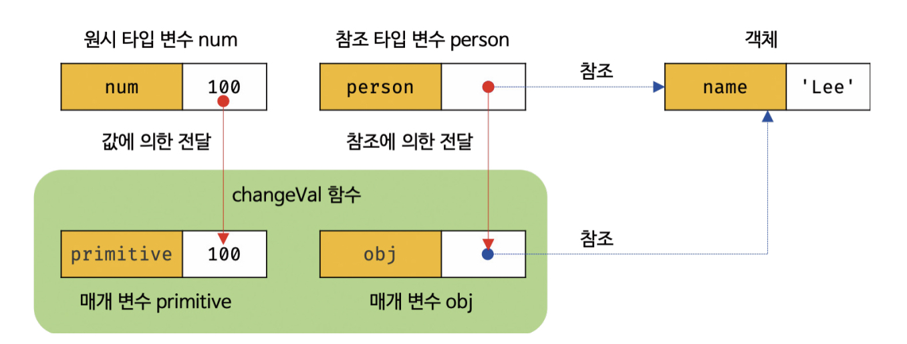

[12장] 함수
===
# 12.1 함수란?
- 일련의 과정을 문(statement)로 구현하고, 코드 블록으로 감싸서 하나의 실행 단위로 정의한 것. 
- 매개변수 : 입력을 전달받는 변수
- 인수 : 입력 값
- 반환값(return value) : 출력
- 함수는 '정의'하고 '호출'하는 것. 

# 12.2 함수의 사용 이유
- 코드의 재사용성 : 중복을 제거하고, 몇 번이든 호출하여 재사용 할 수 있음
- 유지보수의 편의성, 코드의 신뢰성
- 코드의 가독성 :  함수는 객체 타입의 값. -> 식별자 존재. 

# 12.3 함수 리터럴
- 자바스크립트의 함수는 객체 타입의 값. -> 함수 리터럴로 생성할 수 있음
- function 키워드, 함수 이름(생략 가능, 함수 몸체 내에서만 참조 가능한 식별자), 매개 변수 목록, 함수 몸체 
```js
//변수에 함수 리터럴 할당
var f = function add(x, y) {
    return x + y;
};
```
# 12.4 함수 정의 
## 12.4.1 함수 선언문
### [12-05]
```js
//함수 선언문
function add(x, y){
    return x+y;
}
```
- 함수 선언문은 함수 리터럴과 형태가 동일
- 함수 리터럴은 함수 이름을 생략할 수 있으나, 함수 선언문은 함수 이름을 생략할 수 없음 
- 함수 선언문은 표현식이 아닌 문. -> 표현식이 아니므로 변수에 할당할 수 없음 

```js
//함수 선언문은 표현식이 아니므로 변수에 할당할 수 없다.
//하지만 함수 선언문이 변수에 할당되는 것처럼 보인다. 
var add = function add(x,y) {
    return x+y;
}
```
- 자스 엔진이 코드의 문맥에 따라 함수리터럴을 함수 선언문으로 해석하는 경우도 있기 때문.
- 함수 선언문은 함수 이름을 생략할 수 없는 점을 제외하면 함수 리터럴과 형태가 동일 -> 기명 함수 리터럴은 함수 선언문으로도 해석 가능
- 자바스크립트 엔진은 기명 함수 리터럴

```js
기명함수 리터럴
var x = function add(x,y){
    return x+y;
}
```
- 기명 함수 리터럴은 코드 문맥에 따라 함수 선언문 또는 함수 리터럴 표현식으로 해석된다. 
- 이는 호출에서 차이가 있다.
- 함수 선언문으로 생성된 함수는 호출할 수 있으나, 함수 리터럴 표현식으로 생성된 함수는 호출할 수 없다. 

함수 표현식 : 함수 리터럴로 생성한 함수 객체를 변수에 할당하는 것, 함수 리터럴의 함수 이름은 생략 가능 -> 익명함수로 쓸 수 있음
```js
//기명 함수 리터럴의 함수 표현식 
// add는 식별자, foo는 함수의 이름
var add = function foo(x) {
    return x;
}
console.log(add(2)); // 2

console.log(foo(2)); // ReferenceError
```
```js
//익명 함수 리터럴의 함수 표현식 
//add는 식별자, 함수의 이름이 아님
var add = function(x, y) {
    return x+y;
}
console.log(add(2)); //2

//함수 선언문
// add는 함수의 이름, 자바스크립트 엔진은 암묵적으로 함수의 이름과 동일한 식별자를 생성한다. 
function add(x + y) {
    return x +y;
}
```

## 12.4.3 함수 생성 시점과 함수 호이스팅 
```js
//함수 참조
console.dir(add); f add(x, y)
console.dir(sub);

//함수호출
console.log(add(2,5)); //7
console.log(sub(2,5)); //TyperError: sub is not a function

//함수 선언문
function add(x, y) {
    return x + y;
}
// 함수 표현식
var sub = function(x, y) {
    return x - y;
};
```
- 함수 선언문으로 정의한 함수는 함수 선언문 이전에 호출할 수 있다.
- 함수 표현식으로 정의한 함수는 함수 표현식 이전에 호출할 수 없다.
- 함수 선언문으로 정의한 함수와 함수 표현식으로 정의한 함수의 생성 시점이 다르기 때문이다. 

- 모든 선언문이 그렇듯 함수 선언문도 런타임 이전에 먼저 실행된다. 
- 함수 선언문으로 함수를 정의하면, 런타임 이전에 함수 객체가 생성되고, 함수 이름과 동일한 이름의 식별자를 암묵적으로 생성해 생성된 함수 객체에 할당한다. 
- 함수 호이스팅(function hoisting) : 함수 선언문이 코드의 선두로 끌어 올려진 것처럼 동작하는 자바스크립트 고유의 특징

- 변수 호이스팅 : var 키워드로 선언된 변수는 undefined로 초기화 -> 변수 선언문 이전에 변수를 참조하면, undefined로 평가
- 함수 호이스팅 : 암묵적으로 생성된 식별자는 함수 객체로 초기화 -> 함수 호이스팅에 의해 호출이 가능 

```js
//함수 표현식
var sub = function(x, y) {
    return x - y;
};
```
- 함수 표현식은 변수에 할당되는 값이 함수 리터럴인 문. 
- 변수 선언문과 변수 할당문을 한 번에 기술한 축약 표현과 동일하게 작동함
- 변수 선언은 호이스팅 되어 undefined로 초기화된다.
- 변수 할당문의 값은 런타임에 평가되므로 함수 표현식의 함수 리터럴도 할당문이 실행되는 시점에 평가되어 함수 객체가 된다. 
- 함수 표현식으로 정의한 함수는 반드시 함수 표현식 이후에 참조 또는 호출해야 한다. 

## 12.4.4 Function 생성자 함수
⚠ 생성자 함수 : 객체를 생성하는 함수

### [12-13]
```js
var add = new Function('x', 'y', 'return x + y');

console.log(add(2,5)); //7
```
- Function 생성자 함수로 함수를 생성하는 방식은 바람직하지 않다.
- 클로저(closure)를 생성하지 않는 등 함수 선언문이나 함수 표현식으로 생성한 함수와 다르게 동작한다. 

### [12-14]
```js
var add1 = (function () {
    var a = 10;
    return function (x, y) {
        return x + y + a;
    }
}());

console.log(add1(1,2)); //13

var add2 = (function () {
    var a = 10;
    return new Function('x', 'y', 'return x + y + a;');
}());

console.log(add2(1,2)); // ReferenceError: a is not defined 
```
- Function 생성자 함수로 생성된 함수는 클로저를 생성하지 않는다. 

## 12.4.5 화살표 함수 
- ES6에서 도입
- 화살표 함수는 항상 익명 함수로 정의한다.
- 생성자 함수로 사용할 수 없다
- 기존 함수와 this 바인딩 방식이 다르다
- prototype 프로퍼티가 없다
- arguments 객체를 생성하지 않는다
- 26.3절에서 후술

# 12.5 함수 호출
## 12.5.1 매개변수와 인수
- 매개변수는 함수를 정의할 때 선언하며, 함수 몸체 내부에서 변수와 동일하게 취급한다.
- 함수가 호출되면 함수 몸체 내에서 암묵적으로 매개변수가 생성되고, 일반 변수와 마찬가지로 undefined로 초기화된 이후 인수가 순서대로 할당된다. 
- 매개변수는 함수 몸체 내부에서만 참조할 수 있고, 함수 몸체 외부에서는 참조할 수 없다. 즉, 스코프는 함수 내부이다. 

### [12-18]
```js
function add(x, y) {
    return x + y;
}
console.log(add(2)); // NaN
```
- 인수가 부족해서 인수가 할당되지 않는 매개변수의 값은 undefined이다. 
- 2 + undefined와 같으므로 NaN이 반환된다.

### [12-19]
```js
function add(x, y) {
    return x + y;
}
console.log(add(2, 5, 10)); //7
```
- 매개변수보다 인수가 더 많은 경우 초과된 인수는 무시된다. 

### [12-20]
```js
function add(x, y) {
    console.log(arguments); 
    return x + y;
}
add(2, 5, 10);
// Arguments(3) [2, 5, 10, callee: ƒ, Symbol(Symbol.iterator): ƒ]
//7
```
- 초과된 인수가 그냥 버려지는 것은 아니다.
- 모든 인수는 암묵적으로 arguments 객체의 프로퍼티로 보관된다. 

## 12.5.2 인수 확인
- 1. 자바스크립트의 함수는 매개변수와 인수의 개수가 일치하는지 확인하지 않는다.
- 2. 자바스크립트는 동적 타입의 언어이기 때문에, 매개변수의 타입을 사전에 지정할 수 없다.
-> 함수를 정의할 때 적절한 인수가 전달되었는지 확인할 필요가 있다. 

### [12-23]
```js
function add(x, y) {
    if (typeof x !== 'number' || typeof y !== 'number') {
        throw new TypeError('인수는 모두 숫자 값이어야 합니다.');
    }
    return x + y;
}
console.log(add(2)); //TypeError: 인수는 모두 숫자 값이어야 합니다.
console.log(add('a','b')); //TypeError: 인수는 모두 숫자 값이어야 합니다.
```
### [12-24] 
```js
function add(a, b, c) {
    a = a || 0;
    b = b || 0;
    c = c || 0;
    return a + b + c;
}
```
- 인수가 전달되지 않은 경우 단축 평가를 사용해 매개변수에 기본값을 할당하는 방법도 있다.
- ES6에서 도입된 매개변수 기본값을 사용할 수도 있다. 

## 12.5.3 매개변수의 최대 개수
이상적인 함수는 한 가지 일만 해야하며 가급적 작게 만들어야 한다. 

## 12.5.4 반환문
- 반환문은 함수의 실행을 중단하고 함수 몸체를 빠져나간다. 반환문 이후의 문은 실행되지 않고 무시된다.
- return 키워드 뒤에 오는 표현식을 평가해서 반환한다. -> 반환문이 없으면 undefined를 반환
- 함수 몸체 내부에서만 사용할 수 있고, 전역에서 사용시 SyntaxError가 발생한다. 


# 12.6 참조에 의한 전달과 외부 상태의 변경
</img><br/>

# 12.7 다양한 함수의 형태
## 12.7.1 즉시 실행 함수(IIFE)
- 단 한 번만 호출되며 다시 호출할 수 없다.
### [12-34,35]
```js
//익명 즉시 실행 함수
(function () {
    var a = 3;
    var b = 5;
    return a * b;
}());

//기명 즉시 실행 함수 
(function foo() {
    var a = 3;
    var b = 5;
    return a * b;
}());
foo(); // ReferenceError
```
- 즉시 실행 함수는 익명 함수를 사용하는 것이 일반적이다. 
- 그룹 연산자 () 내의 기명함수는 함수 선언문이 아닌 함수 리터럴로 평가된다
- 함수 이름은 함수 몸체에서만 참조할 수 있는 식별자로 즉시 실행 함수를 다시 호출할 수 없다.

### [12-41]
```js
//첫 번째 방법
(function () {
    // ... 
}());

//두 번째 방법
(function () {
    // ... 
})();

//세 번째 방법
!function () {
    // ... 
}();

// 네 번째 방법
+function () {
    // ... 
}();
```
- 그룹 연산자로 함수를 묶은 건 함수 리터럴을 평가해 함수 객체를 생성하기 위해서이다.
- 함수 리터럴을 평가해 함수 객체를 생성할 수 있다면 () 그룹 연산자 이외의 연산자를 사용해도 좋다
- 가장 일반적인 방식은 첫 번째 방식이다. 

### [12-42]
```js
//즉시 실행 함수도 인수를 전달할 수 있다.
var res = (function (a, b) {
    return a * b;
}(3, 5));

console.log(res); //15
```

## 12.7.2 재귀 함수 
- 재귀 함수는 자신을 무한 재귀 호출하기 때문에, 반드시 탈출 조건을 만들어야 한다.

## 12.7.3 중첩 함수
- 함수 내부에 정의된 함수를 중첩 함수(nested function) 또는 내부 함수(inner function)라 한다. 
- 중첩 함수를 포함하고 있는 함수를 외부 함수(outer function)라 부른다. 
- 호이스팅으로 인해 혼란이 발생할 수 있으므로if문이나 for문 등 코드 블록에서 함수 선언문을 통해 함수를 정의하는 것이 바람직하다.

## 12.7.4 콜백 함수
- 자바스크립트의 함수는 일급 객체이므로 함수의 매개변수를 통해 함수를 전달하 수 있다. 
- 함수의 매개변수를 통해 다른 함수의 내부로 전달되는 함수를 '콜백함수'라고 한다.
- 매개변수를 통해 함수의 외부에서 콜백 함수를 전달받은 함수를 고차함수(Higher-Order Function, HOF)라고 한다. 
- 고차 함수는 콜백 함수를 자신의 일부분으로 합성한다. 
- 콜백 함수는 고차 함수에 의해 호출되며 이때 고차 함수는 필요에 따라 콜백 함수에 인수를 전달할 수 있다. 

### [12-52]
```js
function repeat(n, f) {
    for (var i = 0; i < n; i++>) {
        f(i);
    }
}
repeat(5, function (i){
    if (i % 2) {
        console.log(i);
    }
}); //1,3
```
- 콜백 함수가 고차 함수 내부에만 호출된다면, 콜백 함수를 익명 함수 리터럴로 정의하면서 곧바고 고차 함수에 전달하는 것이 일반적이다. 
- 콜백 함수는 고차 함수가 호출될 때마다 평가되어 함수 객체를 생성한다. -> 콜백 함수를 전달 받는 함수가 자주 호출된다면 함수 외부에서 콜백 함수를 정의한 후 함수 참조를 고차 함수에 전달하는 편이 효율적이다.

## 12.7.5 순수 함수와 비순수 함수
- 순수 함수(pure function) : 어떤 외부 상태에 의존하지도 않고 변경하지도 않는, 즉 부수 효과가 없는 함수
- 비순수 함수(impure function) : 외부 상태에 의존하거나 외부 상태를 변경하는, 즉 부수 효과가 있는 함수
- 함수가 외부 상태를 변경하면 상태 변화를 추적하기 어려워진다. 따라서 순수 함수를 사용하는 것이 좋다. 

### [12-56]순수함수
```js
var count = 0;

//순수 함수 increase는 동일한 인수가 전달되면 언제나 동일한 값을 반환한다.
function increase(n) {
    return ++n;
}

// 순수 함수가 반환한 결과값을 변수에 재할당해서 상태를 변경한다
count = increase(count);
console.log(count); // 1

count = increase(count);
console.log(count); //2
```

### [12-57]
```js
var count = 0;

function () {
    return ++count;
}

// 비순수 함수는 외부 상태(count)를 변경하므로 상태 변화를 추적하기 어려워진다. 
increase();
console.log(count); //1

increase();
console.log(count); //2
```