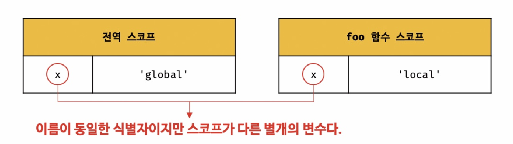

[13장] 스코프
===
# 13.1 스코프란?
- 스코프는 식별자가 유효한 범위, 즉 다른 코드가 변수를 참조할 수 있는 범위를 뜻한다.
- 모든 식별자(변수 이름, 함수 이름, 클래스 이름 등)는 자신이 선언된 위치에 의해 유효 범위가 결정된다. 

### [13-03]
```js
var x = 'global';

function foo() {
    var x = 'local';
    console.log(x); //1️⃣
}

foo(); // local
console. log(x); //2️⃣ //global
```
- 1️⃣, 2️⃣ 에서 변수 x를 참조했고, 자바스크립트 엔진은 '식별자 결정' 과정을 통해 어떤 변수를 참조해야할지 결정한다. 

</img><br/>
- 두 개의 x 변수는 식별자 이름이 동일하지만 스코프가 다른 별개의 변수이다. 
- 컴퓨터에서 디렉터리가 다르면, 같은 이름의 파일을 여러개 저장할 수 있는 것과 비슷한 개념. 
- 스코프(유효 범위)를 통해 식별자인 변수 이름의 충돌을 방지한다. 


# 13.2 스코프의 종류
- 전역 스코프
- 지역 스코프

## 13.2.1 전역과 전역 스코프(global scope)
- 전역 : 코드의 가장 바깥 영역
- 전역 변수 : 전역에서 선언한 변수
- 전역 스코프 : 전역 변수가 가지는 스코프 
- 전역 변수는 **어디서든지 참조할 수 있다.**

## 13.2.2 지역과 지역 스코프(local scope)
- 지역 : 함수 몸체 내부
- 지역 변수 : 지역(함수 내부)에서 선언한 변수
- 지역 스코프 : 지역 변수가 가지는 스코프 
- 지역 변수는 자신의 지역 스코프와 하위 지역 스코프에서 유효하다.

# 13.3 스코프 체인 
- 함수는 중첩될 수 있으므로 함수의 지역 스코프도 중첩될 수 있다. 
- 따라서 스코프는 함수의 중첩에 의해 계층적 구조를 갖는다. 
- 스코프 체인 : 스코프가 계층적으로 연결된 것.
- 변수를 참조할 때, 자스 엔진은 스코프 체인을 통해 변수를 검색한다. 
- 변수를 참조하는 코드의 스코프에서 시작하여 상위 스코프 방향으로 이동하면서 검색한다. -> 상위 스코프에서 선언한 변수를 하위 스코프에서도 참조할 수 있다. 

⚠ 렉시컬 환경..
머..? -> 23장 읽고 다시 돌아오자

## 13.3.1 스코프 체인에 의한 변수 검색
- 상위 스코프에서 유효한 변수는 하위 스코프에서 자유롭게 참조할 수 있지만, 하위 스코프에서 유효한 변수를 상위 스코프에서 참조할 수는 없다. 

## 13.3.2 스코프 체인에 의한 함수 검색
- 함수 선언문으로 함수를 정의했을 때, 자바스크립트 엔진은 함수 이름과 동일한 이름의 식별자를 암묵적으로 선언하고, 생성된 함수 객체를 할당한다.(12장)
- 즉, 함수도 식별자에 할당되기 때문에 스코프를 갖는다.
```js
//전역 함수
function foo() {
    console.log('global')
}

function bar(){
    //중첩함수
function foo(){
console.log('local')
}
foo(); //1️⃣
}

bar(); // local
```
- 1️⃣에서 함수를 호출하면, 자바스크립트 엔진은 식별자 foo를 검색한다.
- 일반 변수와 똑같은 방식으로 스코프 체인을 따라 식별자를 검색한다. 

# 13.4 함수 레벨 스코프
- 블록 레벨 스코프 vs 함수 레벨 스코프
- 블록 레벨 스코프 : 모든 코드 블록(if, for, while, ...)이 지역 스코프를 만드는 특성
- 함수 레벨 스코프 : 함수의 코드 블록(함수 몸체)만이 지역 스코프를 만드는 특성
- var 키워드로 선언된 변수는 함수 레벨 스코프를 갖는다.
- ES6에서 도입된 let, const의 경우엔 블록 레벨 스코프를 갖는다.

### ☝  var 키워드로 선언한 변수의 중복 선언

- var 키워드로 선언된 변수는 같은 스코프 내에서 중복 선언이 허용된다.
- let, const 키워드로 선언된 변수는 같은 스코프 내에서 중복 선언이 허용되지 않는다. (let, const에 대해서는 15장에서 후술)

### [13-07]
```js
var x = 1;
if (true) {
    var x = 10;
}
console.log(x); //10
```
- var 키워드는 함수의 코드 블록만을 지역 스코프로 인정한다.
- if 문은 지역 스코프를 만들지 못한다. 따라서 if문 안의 x도 전역변수 이다.
- 같은 스코프 내에서 x가 중복 선언되었지만 var 키워드로는 같은 스코프 내의 중복 선언이 허용된다.

### [13-08] 
```js
var i = 0;

for (var i = 0; i < 5; i++) {
    console.log(i); // 0 1 2 3 4 
}
console.log(i); //5
```
- for 문에서 선언된 변수 i도 var로 선언되었기 때문에 전역변수이다.
- i는 중복선언 되었고, 값이 재할당되었다. 

# 13.5 렉시컬 스코프
- 동적 스코프 : 함수가 호출된 위치에 따라 상위 스코프를 결정한다 -> 함수를 정의하는 시점에는 상위 스코프를 알 수 없다. 
- 렉시컬 스코프(정적 스코프) : 함수가 정의(함수 선언문, 함수 표현식)가 평가되는 시점에 상위 스코프가 결정된다. 함수가 호출된 위치는 상위 스코프 결정에 어떠한 영향도 주지 않는다. 
- 자바스크립트는 **렉시컬 스코프**를 따른다. 


### [13-09]
```js
var x = 1;

function foo() {
    var x = 10;
    bar();
}

function bar() {
    console.log(x);
}

foo(); //1
bar(); //1
```
- 함수 bar()는 전역에서 정의된 함수이므로 전역 스코프를 상위 스코프로 기억한다. 
- 함수가 호출된 위치(함수 foo() 내부)는 영향을 주지 않으므로, x를 참조할 때, 함수 foo()의 지역 변수 x가 아닌 전역 변수 x를 참조하여 1을 두 번 출력한다. 
- 렉시컬 스코프는 클로저와 깊은 관계가 있다. (24장 클로저에서  후술)