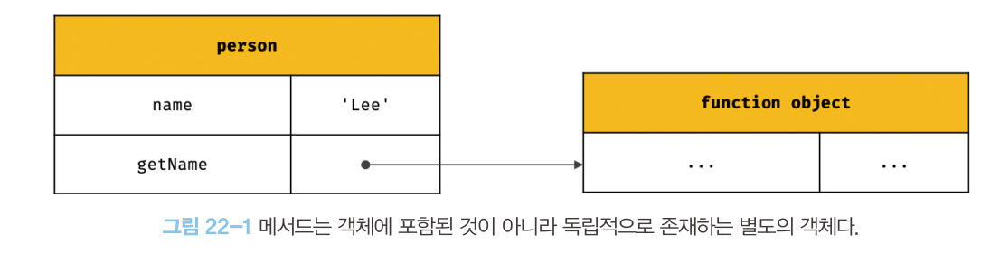

<<<<<<< HEAD
[22장] this
===
# 22.1 this 키워드 
- 객체 리터럴 방식으로 생성한 객체의 경우 메서드 내부에서 객체를 가리키는 식별자를 재귀적으로 참조할 수 있다. 
### [22-01]
```js
const circle = {
    radius = 5, 
    getDiameter() {
        //메서드 내에서 메서드 자신이 속한 객체를 가리키는 식별자 circle을 참조하고 있음
        return 2 * circle.radius
    }
}
```

- 생성자 함수 방식으로 인스턴스를 생성하는 경우는 다름
- 생성자 함수를 정의하는 시점에는 인스턴스를 가리키는 식별자를 알 수 없음.
- **this** : 자신이 속한 객체 또는 자신이 생성할 인스턴스를 가리키는 자기 참조 변수이다. 
- this를 통해 **자신이 속한 객체** 또는 **자신이 생성할 인스턴스**의 프로퍼티나 메서드를 참조할 수 있다.  
- 즉, this 바인딩(this와 this가 가리킬 객체를 바인딩 하는 것)은 함수 호출 방식에 의해 동적으로 결정된다. (22.2에서 더 자세히 나옵니다!)

### [22-03] this가 자신이 속한 객체를 가리킬 때
```js
//객체 리터럴
const circle = {
    radius: 5,
    getDiameter() {
        return 2* this.radius;
    }
};
```
- 객체 리터럴의 메서드 내부에서의 this는 메서드를 호출한 객체, 즉 circle을 가리킨다.

### [22-04] this가 자신이 생성할 인스턴스를 가리킬 때
```js
//생성자 함수
function  Circle(radius) {
    this.radius = radius;
}

Circle.prototype.getDiameter = function() {
    return 2 * this.radius;
};

//인스턴스 생성
const circle = new Circle(5);
console.log(circle.getDiameter()); //10
```
- 생성자 함수 내부의 this는 생성자 함수가 생성할 인스턴스를 가리킨다. 

# 22.2 함수 호출 방식과 this 바인딩
- this 바인딩은 함수 호출 방식에 따라 동적으로 결정된다. (즉, 렉시컬 스코프와는 다르게 정의되어 평가되는 시점이 아닌 호출되는 시점에 결정된다.)
- 함수의 호출 방식
    1. 일반 함수 호출
    2. 메서드 호출
    3. 생성자 함수 호출
    4. Function.prototype.apply/call/bind 메서드에 의한 간접 호출

## 22.2.1 일반 함수 호출
기본적으로 this에 전역 객체가 바인딩 된다. 
### [22-07]
```js
function foo() {
    console.log(this); //window
    function bar() {
        console.log(this); //window
    }
    bar();
}
foo();
```
- 함수를 일반 함수로 호출하면 함수 내부의 this에는 전역 객체가 바인딩 된다. 

### [22-08]
```js
function foo() {
    'use strict';

    console.log(this); //undefined
    function bar() {
        console.log(this); // undefined
    }
    bar();
}
foo();
```
- strict mode 에서는 일반 함수 내부의 this에는 undefined가 바인딩 된다. 

### [22-09] 메서드 중첩 함수 내의 this
```js
var value = 1;

const obj = {
    value: 100;
    foo() {
        console.log(this); // {value: 100, foo: f}
        console.log(this.value); // 100
        
        function bar() {
        console.log(this); //window
        console.log(this.value); //1
        }

        bar();
    }
}
obj.foo(); 
```

- 메서드 내에서 정의한 중첩 함수도 일반 함수로 호출되면 this에는 전역 객체가 바인딩 된다. 

### [22-10] 콜백 함수 내부의 this
```js
var value = 1;

const obj = {
    value: 100,
    foo() {
        console.log(this);
        
                    //콜백 함수
        setTImeout(function() {
            console.log(this); //window
            console.log(this.value); //1
        }, 100);
    }
}

obj.foo();
```

- 콜백 함수가 일반 함수로 호출된다면, 콜백 함수의 내부의 this에도 전역 객체가 바인딩 된다. 

- 위와같이, 메서드 내 중첩 함수 또는 메서드에 전달된 콜백 함수가 메서드의 this와 일치하지 않는 것은 헬퍼 함수로 동작하기 어렵게 만든다.
- 메서드 내부의 중첩 함수나 콜백 함수의 this 바인딩을 메서드의 this 바인딩과 일치시키는 방법?
### [22-11] 방법 1
```js
var value = 1;

const obj = {
    value: 100,
    foo() {
        // this 바인딩을 변수 that에 할당한다.
        // that은 obj를 가리킨다. 
        const that = this;

        //콜백 함수 내부에서는 this 대신 that을 참조한다.
        setTimeout(function() {
            console.log(that.value); //100
        }, 100);
    }
};

obj.foo();
```

### [22-12] 방법2 - bind() 메서드 활용
```js
var value = 1;

const obj = {
    value: 100,
    foo() {
        //콜백 함수에 명시적으로 this를 바인딩한다. 
        setTimeout(function() {
            console.log(this.value); 
        }.bind(this), 100)
    }
};

obj.foo();
```
- 22.2.4에서 다시 살펴보자!

### [22-13] 방법 3 - 화살표 함수를 이용
```js
var value = 1;

const obj = {
    value: 100;
    foo() {
        //화살표 함수 내부의 this는 상위 스코프의 this를 가리킨다. 
        setTimeout(()=> console.log(this.value), 100); //100
    }
};

obj.foo();
```
- 화살표 함수 내부의 this는 상위 스코프의 this를 가리킨다. 
- 화살표 함수에 대해서는 26.3절에서 후술

## 22.2.2 메서드 호출
메서드 내부의 this는 메서드를 소유한 객체가 아닌 **메서드를 호출한 객체**에 바인딩 된다. 
- 메서드는 프로퍼티에 바인딩 된 함수이다.
- 즉, 함수 객체는 객체에 포함된 것이 아니라 별도의 객체이다.
- 메서드는 다른 객체의 메서드가 될 수도 있고, 일반 변수에 할당하여 일반 함수로 호출될 수도 있다.  
</img><br/>

### [22-14,15]
```js
const person = {
    name: 'Lee',
    getName() {
        return this.name;
    }
};

console.log(person.getName()); // Lee

const anotherPerson = {
    name: 'Kim'
};

// getName 메서드를 anotherPerson 객체의 메서드로 할당
anotherPerson.getName = person.getName;

//getName 메서드를 호출한 객체는 anotherPerson이다. 
console.log(anotherPerson.getName()); // Kim

//getName 메서드를 변수에 할당
const getName = person.getName;

//getName 메서드를 일반 함수로 호출
// window.name 의 기본값은 ''
console.log(getName()); // ''
```

## 22.2.3 생성자 함수 호출
생성자 함수 내부의 this 에는 생성자 함수가 생성할 인스턴스가 바인딩된다. 
### [22-17, 18] 
```js
//생성자 함수
function Circle(radius) {
    this.radius = radius;
    this.getDiameter = funtion() {
        return 2 * this.radius;
    };
}

const circle1 = new Circle(5);

const circle2 = new Circle(10));

console.log(circle1.getDiameter()); //10
console.log(circle2.getDiameter()); //20

// new 연산자와 함께 호출 하지 않았으므로, 일반 함수의 호출이다.
const circle3 = Circle(15);

//Circle 에는 return이 없으므로 undefined
console.log(circle3); //undefined
//일반함수로 호출된 this는 전역객체를 가리키므로, window.radius 가 15가 된다. 
console.log(radius); // 15
```

## 22.2.4 Function.prototype.apply/call/bind 메서드에 의한 간접 호출
이 메서드는 모든 함수가 상속 받아 사용할 수 있다. 

<br>


### 1. apply()
`Function.prototype.apply(thisArg [, argsArray])`

thisArg : this로 사용할 객체
argsArray: 함수에게 전달할 인수 리스트의 배열 또는 유사 배열 객체

### 2. call()
`Function.prototype.call(thisArg [, arg1 [, arg2[, ...]]])`

thisArg : this로 사용할 객체
arg1, arg2, ... : 함수에게 전달할 인수 리스트


- apply(), call() 메서드는 함수를 호출한다.
- 첫 번째 인수로 전달한 특정 객체를 호출한 함수의 this에 바인딩 한다. 

### [22-20]
```js
function getThisBinding() {
    console.log(arguments);
    return this;
}

//this로 사용할 객체
const thisArg = { a: 1};

console.log(getThisBinding.apply(thisArg, [1,2,3]));
//Arguments(3) [1, 2, 3, callee:f, Symbol(Symbol.iterator): f]
//{ a: 1}

console.log(getThisBinding.call(thisArg, 1,2,3));
//Arguments(3) [1, 2, 3, callee:f, Symbol(Symbol.iterator): f]
//{ a: 1}
```

### [22-10]
```js
function converArgsToArray() {
    console.log(arguments);

    const arr = Array.prototype.slice.call(arguments);

    console.log(arr);

    return arr;
}

converArgsToArray(1, 2, 3); //[1,2,3]
```
- arguments 객체는 배열이 아니기때문에 slice 같은 배열의 메서드를 사용할 수 없으나 apply 나 call 메서드를 이용하면 가능하다.

- 아직 배열에 대해 살펴보지 않았기때문에 지금은 위 예제를 이해하지 못해도 좋다.
( 네,이해 못하겠습니다.)
- 27장 배열과 36장 디스트럭처링 할당에서 자세히 후술

### 3. bind()
- apply와 call 메서드와 달리 함수를 호출하지 않고 this로 사용할 객체만 전달한다.
- 그래서 호출시에는 다음과 같이 명시적으로 호출해야 한다.
- `getThisBinding.bind(thisArg)();`

### [22-23] 콜백 함수의 일반 함수로서의 호출
```js
const person = {
    name: 'Lee',
    foo(callback) {
        setTimeout(callback, 100);
    }
};

person.foo(function() {
    console.log(this.name); // ''
    //일반 함수로 호출된 콜백 함수 내부의 this.name은 window.name과 같다. 
})
```
- 콜백 함수가 일반 함수로서 호출되면, 콜백함수의 내부의 this는 전역객체를 가리킨다. 


### [22-24] bind()를 이용한 this의 일치
```js
const person = {
    name: 'Lee',
    foo(callback) {
        //bind 메서드로 callback 함수 내부의 this 바인딩을 전달
        setTimeout(callback.bind(this), 100);
    }
};

person.foo(function() {
    console.log(this.name); // Lee
})
```
=======
[22장] this
===
# 22.1 this 키워드 
- 객체 리터럴 방식으로 생성한 객체의 경우 메서드 내부에서 객체를 가리키는 식별자를 재귀적으로 참조할 수 있다. 
### [22-01]
```js
const circle = {
    radius = 5, 
    getDiameter() {
        //메서드 내에서 메서드 자신이 속한 객체를 가리키는 식별자 circle을 참조하고 있음
        return 2 * circle.radius
    }
}
```

- 생성자 함수 방식으로 인스턴스를 생성하는 경우는 다름
- 생성자 함수를 정의하는 시점에는 인스턴스를 가리키는 식별자를 알 수 없음.
- **this** : 자신이 속한 객체 또는 자신이 생성할 인스턴스를 가리키는 자기 참조 변수이다. 
- this를 통해 **자신이 속한 객체** 또는 **자신이 생성할 인스턴스**의 프로퍼티나 메서드를 참조할 수 있다.  
- 즉, this 바인딩(this와 this가 가리킬 객체를 바인딩 하는 것)은 함수 호출 방식에 의해 동적으로 결정된다. (22.2에서 더 자세히 나옵니다!)

### [22-03] this가 자신이 속한 객체를 가리킬 때
```js
//객체 리터럴
const circle = {
    radius: 5,
    getDiameter() {
        return 2* this.radius;
    }
};
```
- 객체 리터럴의 메서드 내부에서의 this는 메서드를 호출한 객체, 즉 circle을 가리킨다.

### [22-04] this가 자신이 생성할 인스턴스를 가리킬 때
```js
//생성자 함수
function  Circle(radius) {
    this.radius = radius;
}

Circle.prototype.getDiameter = function() {
    return 2 * this.radius;
};

//인스턴스 생성
const circle = new Circle(5);
console.log(circle.getDiameter()); //10
```
- 생성자 함수 내부의 this는 생성자 함수가 생성할 인스턴스를 가리킨다. 

### [22-05]
```js
//this는 어디서든지 참조 가능하다.
// 전역에서 this는 전역 객체 window를 가리킨다.
console.log(this); //window

function square(number) {
    //일반 함수 내부에서 this는 전역 객체 window를 가리킨다. 
    console.log(this); //window
}


function Person(name) {
    this.name = name;
    //생서자 함수 내부에서 this는 생성자 함수가 생성할 인스턴스를 가리킨다. 
    console.log(this); //Person {name: "Lee"}
}

const me = new Person('Lee');
```
- this는 객체의 프로퍼티나 메서드를 참조하기 위한 자기 참조 변수이므로, 객체의 메서드 내부 또는 생성자 함수 내부에서만 의미가 있다. 
- strict mode가 적용된 일반 함수 내부의 this에는 undefined가 바인딩된다. 

# 22.2 함수 호출 방식과 this 바인딩
- this 바인딩은 함수 호출 방식에 따라 동적으로 결정된다. (즉, 렉시컬 스코프와는 다르게 정의되어 평가되는 시점이 아닌 호출되는 시점에 결정된다.)
- 함수의 호출 방식
    1. 일반 함수 호출
    2. 메서드 호출
    3. 생성자 함수 호출
    4. Function.prototype.apply/call/bind 메서드에 의한 간접 호출

### [22-06]
```js
const foo = function() {
    console.dir(this);
};

//1. 일반 함수 호출
//전역 객체 window를 가리킨다. 
foo(); //window

//2. 메서드 호출
//호출한 객체 obj를 가리킨다
const obj = { foo };
obj.foo(); // obj

//3. 생성자 함수 호출
// 생성자 함수가 생성한 인스턴스를 가리킨다. 
new foo(); // foo {}

//4. Function.prototype.apply/call/bind 메서드에 의한 간접 호출
//foo 함수 내부의 this는 인수에 의해 결정된다. 
const bar = { name : 'bar' };
foo.call(bar); //bar
foo.apply(bar); //bar
foo.bind(bar)(); //bar
```
⚠ call(), apply(), bind() 는 첫번째 인자로 this를 무엇으로 바꿀 것인지를 받는다. 

## 22.2.1 일반 함수 호출
기본적으로 this에 전역 객체가 바인딩 된다. 
### [22-07]
```js
function foo() {
    console.log(this); //window
    function bar() {
        console.log(this); //window
    }
    bar();
}
foo();
```
- 함수를 일반 함수로 호출하면 함수 내부의 this에는 전역 객체가 바인딩 된다. 

### [22-08]
```js
function foo() {
    'use strict';

    console.log(this); //undefined
    function bar() {
        console.log(this); // unndefined
    }
    bar();
}
foo();
```
- strict mode 에서는 일반 함수 내부의 this에는 undefined가 바인딩 된다. 

### [22-09] 메서드 중첩 함수 내의 this
```js
var value = 1;

const obj = {
    value: 100;
    foo() {
        console.log(this); // {value: 100, foo: f}
        console.log(this.value); // 100
        
        function bar() {
        console.log(this); //window
        console.log(this.value); //1
        }

        bar();
    }
}
obj.foo(); 
```
- 메서드 내에서 정의한 중첩 함수도 일반 함수로 호출되면 this에는 전역 객체가 바인딩 된다. 

### [22-10] 콜백 함수 내부의 this
```js
var value = 1;

const obj = {
    value: 100,
    foo() {
        console.log(this);
        
                    //콜백 함수
        setTImeout(function() {
            console.log(this); //window
            console.log(this.value); //1
        }, 100);
    }
}

obj.foo();
```
- 콜백 함수가 일반 함수로 호출된다면, 콜백 함수의 내부의 this에도 전역 객체가 바인딩 된다. 
- 이와같이, 메서드의 this와 일치하지 않는 것은 메서드 내 중첩 함수 또는 메서드에 전달된 콜백 함수를 헬퍼 함수로 동작하기 어렵게 만든다.

### [22-11] 메서드의 this 바인딩과 일치시키는 방법 - 1
```js
var value = 1;

const obj = {
    value: 100,
    foo() {
        // this 바인딩을 변수 that에 할당한다.
        // that은 obj를 가리킨다. 
        const that = this;

        //콜백 함수 내부에서는 this 대신 that을 참조한다.
        setTimeout(function() {
            console.log(that.value); //100
        }, 100);
    }
};

obj.foo();
```

### [22-12] bind() 메서드 활용
```js
var value = 1;

const obj = {
    value: 100,
    foo() {
        //콜백 함수에 명시적으로 this를 바인딩한다. 
        setTimeout(function() {
            console.log(this.value); 
        }.bind(this), 100)
    }
};

obj.foo();
```

### [22-13] 화살표 함수를 이용
```js
var value = 1;

const obj = {
    value: 100;
    foo() {
        //화살표 함수 내부의 this는 상위 스코프의 this를 가리킨다. 
        setTimeout(()=> console.log(this.value), 100); //100
    }
};

obj.foo();
```
- 화살표 함수 내부의 this는 상위 스코프의 this를 가리킨다. 
- 화살표 함수에 대해서는 26.3절에서 후술

## 22.2.2 메서드 호출
메서드 내부의 this는 메서드를 소유한 객체가 아닌 **메서드를 호출한 객체**에 바인딩 된다. 
- 메서드는 프로퍼티에 바인딩 된 함수이다.
- 즉, 함수 객체는 객체에 포함된 것이 아니라 별도의 객체이다.
- 메서드는 다른 객체의 메서드가 될 수도 있고, 일반 변수에 할당하여 일반 함수로 호출될 수도 있다.  
</img><br/>

### [22-14,15]
```js
const person = {
    name: 'Lee',
    getName() {
        return this.name;
    }
};

console.log(person.gerName()); // Lee

const anotherPerson = {
    name: 'Kim'
};

// getName 메서드를 anotherPerson 객체의 메서드로 할당
anotherPerson.getName = person.getName;

//getName 메서드를 호출한 객체는 anotherPerson이다. 
console.log(anotherPerson.getName()); // Kim

//getName 메서드를 변수에 할당
const getName = person.getName;

//getName 메서드를 일반 함수로 호출
// window.name 의 기본값은 ''
console.log(getName()); // ''
```

## 22.2.3 생성자 함수 호출
생성자 함수 내부의 this 에는 생성자 함수가 생성할 인스턴스가 바인딩된다. 
### [22-17, 18] 
```js
//생성자 함수
function Circle(radius) {
    this.radius = radius;
    this.getDiameter = funtion() {
        return 2 * this.radius;
    };
}

const circle1 = new Circle(5);

const circle2 = new Circle(10));

console.log(circle1.getDiameter()); //10
console.log(circle1.getDiameter()); //20

// new 연산자와 함께 호출 하지 않았으므로, 일반 함수의 호출이다.
const circle3 = Circle(15);

//Circle 에는 return이 없으므로 undefined
console.log(circle3); //undefined
//일반함수로 호출된 this는 전역객체를 가리키므로, window.radius 가 15가 된다. 
console.log(radius); // 15
```

## 22.2.4 Function.prototype.apply/call/bind 메서드에 의한 간접 호출
이 메서드는 모든 함수가 상속 받아 사용할 수 있다. 

<br>


### 1. apply()
`Function.prototype.apply(thisArg [, argsArray])`
thisArg : this로 사용할 객체
argsArray: 함수에게 전달할 인수 리스트의 배열 또는 유사 배열 객체

### 2. call()
`Function.prototype.apply(thisArg [, arg1 [, arg2[, ...]]])`
thisArg : this로 사용할 객체
arg1, arg2, ... : 함수에게 전달할 인수 리스트


- apply(), call() 메서드는 함수를 호출한다.
- 첫 번째 인수로 전달한 특정 객체를 호출한 함수의 this에 바인딩 한다. 

### [22-20]
```js
function getThisBinding() {
    console.log(arguments);
    return this;
}

//this로 사용할 객체
const thisArg = { a: 1};

console.log(getThisBinding.apply(thisArg, [1,2,3]));
//Arguments(3) [1, 2, 3, callee:f, Symbol(Symbol.iterator): f]
//{ a: 1}

console.log(getThisBinding.call(thisArg, 1,2,3));
//Arguments(3) [1, 2, 3, callee:f, Symbol(Symbol.iterator): f]
//{ a: 1}
```

### [22-10]
```js
function converArgsToArray() {
    console.log(arguments);

    const arr = Array.prototype.slice.call(arguments);

    console.log(arr);

    return arr;
}

converArgsToArray(1, 2, 3); //[1,2,3]
```
- arguments 객체는 배열이 아니기때문에 slice 같은 배열의 메서드를 사용할 수 없으나 apply 나 call 메서드를 이용하면 가능하다.

- 아직 배열에 대해 살펴보지 않았기 대문에 지금은 위 예제를 이해하지 못해도 좋다.
( 네,이해 못하겠습니다.)
- 27장 배열과 36장 디스트럭처링 할당에서 자세히 후술

### 3. bind()
- apply와 call 메서드와 달리 함수를 호출하지 않고 this로 사용할 객체만 전달한다.
- 그래서 호출시에는 다음과 같이 명시적으로 호출해야 한다.
- `getThisBinding.bind(thisArg)();`

### [22-23] 콜백 함수의 일반 함수로서의 호출
```js
const person = {
    name: 'Lee',
    foo(callback) {
        setTimeout(callback, 100);
    }
};

person.foo(function() {
    console.log(this.name); // ''
    //일반 함수로 호출된 콜백 함수 내부의 this.name은 window.name과 같다. 
})
```
- 콜백 함수가 일반 함수로서 호출되면, 콜백함수의 내부의 this는 전역객체를 가리킨다. 


### [22-24] bind()를 이용한 this의 일치
```js
const person = {
    name: 'Lee',
    foo(callback) {
        //bind 메서드로 callback 함수 내부의 this 바인딩을 전달
        setTimeout(callback.bind(this), 100);
    }
};

person.foo(function() {
    console.log(this.name); // Lee
})
```
>>>>>>> df5c37324067ea3d44ae9f642f9bfea27eda61de
- bind 메서드로 외부 함수의 this를 콜백 함수 내부에 전달하여, this를 일치시켰다. 