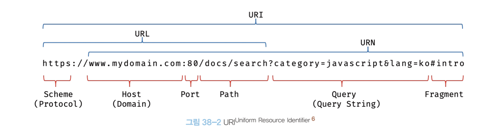

[38장] 브라우저의 렌더링 과정
===
- 클라이언트 사이드 JS는 브라우저에서 HTML, CSS와 함께 실행된다. 
- 브라우저가 HTML, CSS, JS로 작성된 텍스트 문서를 어떻게 파싱(해석)하여 브라우저에 렌더링하는지 알면 더 효율적인 프로그래밍이 가능하다.

## 38.1 요청과 응답
1)
- 브라우저의 핵심 기능 : 필요한 리소스를 서버에 요청(request)하고 서버로부터 응답(response)를 받아 시각적으로 렌더링 하는 것.
- 리소스 : HTML, CSS, JS, 이미지, 폰트 등의 정적 파일과, 서버가 동적으로 생성한 데이터
- 렌더링 : HTML, CSS, JS로 작성된 문서를 파싱하여 브라우저에 시각적으로 출력하는 것
- 파싱 : 프로그래밍 언어의 문법에 맞게 작성된 텍스트 문서를 분해(어휘 분석)하여 트리 구조의 자료구조인 '파스트리'를 생성하는 것. (38.6절에서 후술)

2)
- 서버에 요청(response)을 하기 위해 브라우저는 주소창을 제공
- 주소창에 입력하는 url의 호스트 이름이 DNS를 통해 IP주소로 변환되고 IP주소를 갖는 서버에 요청을 전송한다.
</img> 
- 루트 요청 : /, 스킴(scheme), 호스트(host)으로만 구성된 URI에 의한 요청
- 루트 요청에는 암묵적으로 index.html을 응답(response)하기로 기본 설정되어있음.
- 즉, https://naver.com/ 은 https://naver.com/index.html과 같은 요청이다.
- index.html이 아닌 다른 정적 파일을 서버에 요청하려면, 정적 파일의 경로(path)를 함께 기술하여 서버에 요청한다.
- ajax와 REST API를 이용하면 서버에 정적 데이터 뿐만아니라 동적 데이터도 요청할 수 있다(43장, 44장에서 후술)

3)
여기는 뒤에 나오면 생략하고 안 나오면 넣자

## 38.2 HTTP 1.1과 HTTP 2.0
- HTTP : HyperText Transfer Protocol, 웹에서 브라우저와 서버가 통신하기 위한 프로토콜(규약)이다.

### 1. HPPT 1.1 
- 1999년 발표
- 커넥션 당 하나의 요청과 응답만 처리가 가능하여, 여러 개의 요청을 한 번에 전송,응답 할 수 없다
- 요청할 리소스의 개수에 비례하여 응답 시간도 증가하는 단점

</img> 

### 1. HPPT 2.0
- 2015년 발표
- 커넥션당 여러 개의 요청과 응답, 즉 다중 요청/응답 가능
- HTTP 1.1에 비해 페이지 로드 속도가 약 50%정도 빠르다고 알려져있다. 

</img> 

## 38.3 HTML 파싱과 DOM 생성

</img> 
1. 브라우저에게 요청이 오면, 서버는 브라우저가 요청한 HTML 파일을 읽고 메모리에 저장한 다음, 메모리에 저장된 바이트(2진수)를 인터넷을 경유하여 응답한다. 
2. 서버가 응답한 바이트(2진수) 형태의 HTML 문서를, 브라우저는 meta 태그의 charset 어트리뷰트에 의해 지정된 인코딩 방식(utf-8 등)을 기준으로 문자열로 변환한다.
3. 문자열로 변환된 HTML을 읽어 문법적 의미를 갖는 코드의 최소 단위인 토큰(token)으로 분해한다. 
4. 각 토큰들을 객체로 변환하여 노드(node)를 생성하나다. 토큰의 내용에 따라 문서 노드, 요소 노드, 어트리뷰트 노드, 텍스트 노드가 있고, 노드는 이후 DOM을 생성하는 기본요소가 된다. 
5. HTML 요소간의 중첩 관계에 의해 부자 관계가 형성되고, 이러한 부자 관계를 반영하여 모든 노드들을 트리 자료구조로 구성한다. 이를 DOM(Document Object Model)이라 한다. 
=> 즉, DOM은 HTML 문서를 파싱한 결과이다. DOM 에 대해서는 39장에서 후술한다.

## 38.4 CSS 파싱과 CSSOM 생성
- 렌더링 엔진은 DOM을 생성해 나가다가 CSS를 로드하는 link태그나 style 태그를 만나면 DOM 생성을 일시 중단한다
- CSS를 HTML과 동일한 파싱과정을 거치며 해석하여 CSSOM(CSSObject Model)을 생성한다
- 이후 CSS 파싱을 완료하면 HTML 파싱이 다시 재개되어 DOM 생성을 재개한다. 
- CSSOM 은 CSS의 상속을 반영하여 생성된다. 
- 즉, body 요소에 적용한 프로퍼티와 ul 요소에 적용한 프로퍼티는 모든 li 요소에 상속되고, 그 상속 관계가 반영되어 CSSOM을 생성한다. 

## 38.5 렌더 트리 생성
- DOM과 CSSOM은 렌더링을 위해 렌더 트리(render tree)로 결합된다. 
- 렌더 트리는 렌더링을 위한 트리 구조의 자료구조로, 브라우저 화면에 렌더링 되지 않는 노드(meta태그, script 태그 등)와 css에 의해 비표시 되는 노드들(display: none; 등)은 포함되지 않는다. 
- 완성된 렌더트리는 각 HTML 요소의 레이아웃(위치와 크기)을 계산하는 데 사용되며, 브라우저 화면에 픽셀을 렌더링하는 페인팅(painting) 처리에 입력된다. 
- 브라우저의 렌더링 과정은 반복해서 실행될 수 있고, 다음과 같은 경우 반복해서 레이아웃 계산과 페인팅이 재차 실행된다.
    - 자바스크립트에 의한 노드 추가 또는 삭제
    - 브라우저 창의 리사이징에 의한 뷰포트 크기 변경
    - HTML 요소의 레이아웃(위치, 크기)에 변경을 발생시키는 width/height, margin, padding, border, display, position, top/right/bottom/left 등의 스타일 변경

- 레이아웃과 페인팅을 다시 실행하는 리렌더링은 성능에 악영향을 주는 작업이다.
- 따라서 가급적 리렌더링이 빈번하게 발생하지 않도록 할 필요가 있다.

## 38.6 자바스크립트 파싱과 실행
