[44장]REST API
===
- REST는 HTTP를 기반으로 클라이언트가 서버의 리소스에 접근하는 방식을 규정한 아키텍쳐이다.
- REST API는 REST를 기반으로 서비스 API를 구현한 것을 의미한다.
JSON Server가 데이터 베이스를 하는 db.json 파일의 
npm start 명령어를 통해 JSON Server가 실행됨

# 44.1 REST API의 구성
- 자원(resource), 행위, 표현의 3가지 요소로 구성된다
- 자원(resource) : 리소스를 의미, URI(엔드포인트)로 표현됨
- 행위 : 리소스에 대한 행위, HTTP 요청 메서드로 표현됨
- 표현 : 리소스에 대한 행위의 구체적인 내용, 페이로드로 표현됨
- URI :
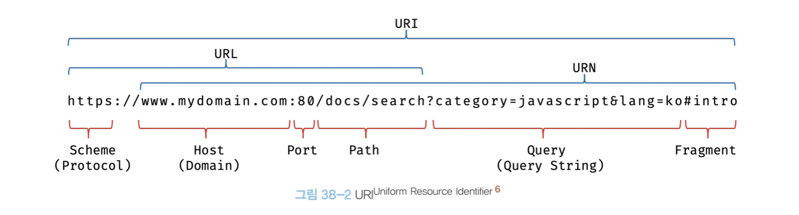</img><br/>
- 페이로드 : 전송되는 데이터를 의미. 페이로드의 유무는 전송되는 데이터가 있느냐 없느냐를 의미. 

# 44.2 REST API 설계 원칙

1. URI는 리소스를 표현해야 한다. 
- 이름은 동사보다는 명사를 사용
```
# bad
GET /getTodos/1
GET /todos/show/1

#good
GET /todos/1
```
2. 리소스에 대한 행위는 HTTP 요청 메서드로 표현한다.
- HTTP 요청 메서드는 클라이언트가 서버에게 요청의 종류와 목적을 알리는 방법
- 주로 5가지 요청 메서드(GET, POST, PUT, PATCH, DELETE)를 사용한다. 
- GET : 리소스 취득, 페이로드 x
- POST : 리소스 생성, 페이로드 o
- PUT : 리소스의 전체 교체, 페이로드 o
- PATCH : 리소스의 일부 수정, 페이로드 o
- DELETE : 리소스 삭제, 페이로드 x

# 44.3 JSON Server를 이용한 REST API 실습
## 44.3.1 JSON Server 설치
```
npm init -y
npm install json-server --save-dev
```

## 44.3.2 db.json 파일 생성
- 프로젝트 루트 폴더에 db.json을 생성.
- db.json 파일은 리소스를 제공하는 데이터베이스 역할을 한다. 

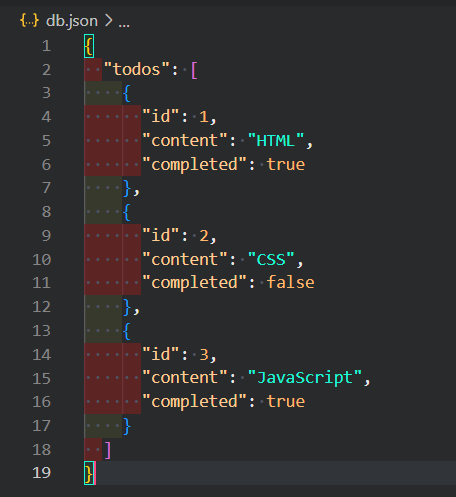</img><br/>

## 44.3.3 JSON Server 실행
`npm start`

Resources
http://localhost:3000/todos

Home
http://localhost:3000
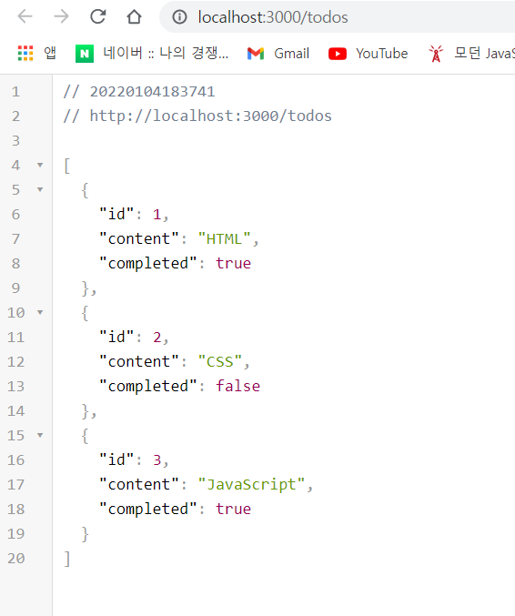</img><br/>
## 44.3.4 GET 요청
- GET요청은 리소스 취득할 때 사용하는 요청메서드이다.
```html
<!DOCTYPE html>
<html lang="en">
<head>
    <meta charset="UTF-8">
    <meta http-equiv="X-UA-Compatible" content="IE=edge">
    <meta name="viewport" content="width=device-width, initial-scale=1.0">
    <title>get_index</title>
</head>
<body>
    <pre></pre>
    <script>
        // XMLHttpRequest 생성
        const xhr =  new XMLHttpRequest();
        // HTTP 요청 초기화
        // todos 리소스에서 모든 todo를 GET 방식으로 취득
        xhr.open('GET', '/todos');

        // HTTP 요청 전송
        xhr.send();

        // load 이벤트는 요청이 성공적으로 완료된 경우 발생한다. 
        xhr.onload = () => {
            // status 프로퍼티 값이 200이면 정상적으로 응답된 상태
            if(xhr.status === 200) {
                document.querySelector('pre').textContent = xhr.response;
            } else {
                console.log('Error', xhr.status, xhr.statusText);
            }
        };
    </script>
</body>
</html>

```
- XMLHttpRequest.open(method, url) : The XMLHttpRequest method open() initializes a newly-created request, or re-initializes an existing one.
- http://localhost:3000/get_index.html 로 접속

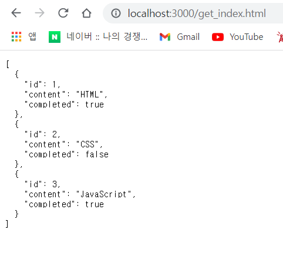</img><br/>

---

## 44.3.5 POST 요청
- 리소스 생성할 때 사용하는 요청 메서드이다. 
- POST 요청 시에는 setRequestHeader 메서드를 사용하여 요청 몸체에 담아 서버로 전송할 페이로드의 MIME 타입을 지정해야 한다. 
- MIME 타입 : MIME 타입이란 클라이언트에게 전송된 문서의 다양성을 알려주기 위한 메커니즘입니다.

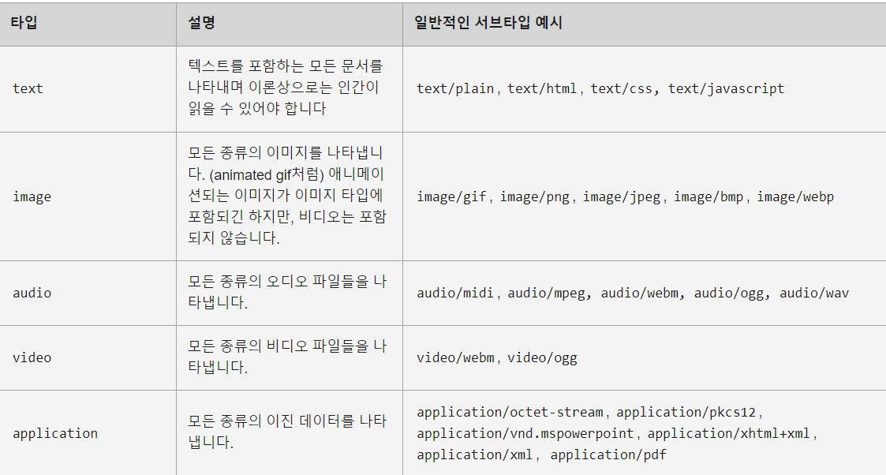</img><br/>

```HTML
<!DOCTYPE html>
<html lang="en">
<head>
    <meta charset="UTF-8">
    <meta http-equiv="X-UA-Compatible" content="IE=edge">
    <meta name="viewport" content="width=device-width, initial-scale=1.0">
    <title>Document</title>
</head>
<body>
    <pre></pre>
    <script>
        // XMLHttpRequest 생성
        const xhr =  new XMLHttpRequest();

        // HTTP 요청 초기화
        // todos 리소스에서 새로운 todo를 생성
        xhr.open('POST', '/todos');

        // 요청 몸체에 담아 서버로 전송할 페이로드의 MIME 타입을 지정
        xhr.setRequestHeader('content-type', 'application/json');

        // HTTP 요청 전송
        xhr.send(JSON.stringify({ id: 4, content: 'Angular', completed: false }));

        // load 이벤트는 요청이 성공적으로 완료된 경우 발생한다. 
        xhr.onload = () => {
            // status 프로퍼티 값이 200이면 정상적으로 응답된 상태
            if(xhr.status === 200 || xhr.status === 201) {
                document.querySelector('pre').textContent = xhr.response;
            } else {
                console.log('Error', xhr.status, xhr.statusText);
            }
        };
    </script>
</body>
</html>
```
- http://localhost:3000/post.html 로 접속

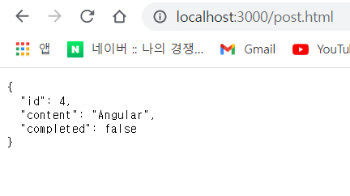</img><br/>
- db.json 파일

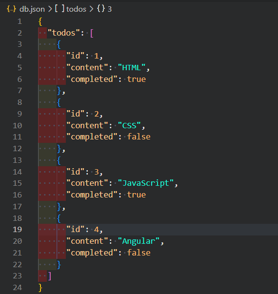</img><br/>

---

## 44.3.6 PUT 요청
- 리소스의 전체를 교체할 때 사용하는 요청 메서드이다. 
- PUT 요청 시에는 setRequestHeader 메서드를 사용하여 요청 몸체에 담아 서버로 전송할 페이로드의 MIME 타입을 지정해야 한다. 
```HTML
<!DOCTYPE html>
<html lang="en">
<head>
    <meta charset="UTF-8">
    <meta http-equiv="X-UA-Compatible" content="IE=edge">
    <meta name="viewport" content="width=device-width, initial-scale=1.0">
    <title>Document</title>
</head>
<body>
    <pre></pre>
    <script>
        // XMLHttpRequest 생성
        const xhr =  new XMLHttpRequest();

        // HTTP 요청 초기화
        // todos 리소스에서 id로 todo를 특정하여 id를 제외한 리소스 전체를 교체
        xhr.open('PUT', '/todos/4');

        // 요청 몸체에 담아 서버로 전송할 페이로드의 MIME 타입을 지정
        xhr.setRequestHeader('content-type', 'application/json');

        // HTTP 요청 전송
        xhr.send(JSON.stringify({ id: 4, content: 'React', completed: true }));

        // load 이벤트는 요청이 성공적으로 완료된 경우 발생한다. 
        xhr.onload = () => {
            // status 프로퍼티 값이 200이면 정상적으로 응답된 상태
            if(xhr.status === 200) {
                document.querySelector('pre').textContent = xhr.response;
            } else {
                console.log('Error', xhr.status, xhr.statusText);
            }
        };
    </script>
</body>
</html>
```
- http://localhost:3000/put.html 로 접속

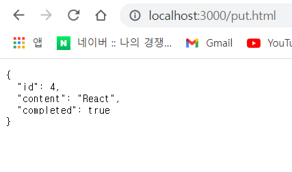</img><br/>
- db.json 파일

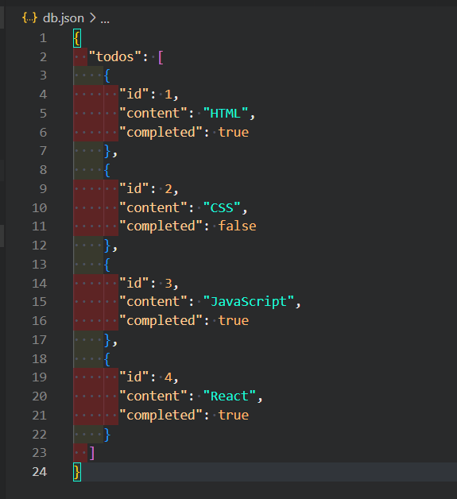</img><br/>

---

## 44.3.7 PATCH 요청
- 리소스의 일부를 수정할 때 사용하는 요청 메서드이다.
- PUT 요청 시에는 setRequestHeader 메서드를 사용하여 요청 몸체에 담아 서버로 전송할 페이로드의 MIME 타입을 지정해야 한다. 
```html
<!DOCTYPE html>
<html lang="en">
<head>
    <meta charset="UTF-8">
    <meta http-equiv="X-UA-Compatible" content="IE=edge">
    <meta name="viewport" content="width=device-width, initial-scale=1.0">
    <title>Document</title>
</head>
<body>
    <pre></pre>
    <script>
        // XMLHttpRequest 생성
        const xhr =  new XMLHttpRequest();

        // HTTP 요청 초기화
        // todos 리소스에서 id로 todo를 특정하여 completed만 수정
        xhr.open('PATCH', '/todos/4');

        // 요청 몸체에 담아 서버로 전송할 페이로드의 MIME 타입을 지정
        xhr.setRequestHeader('content-type', 'application/json');

        // HTTP 요청 전송
        xhr.send(JSON.stringify({completed: false }));

        // load 이벤트는 요청이 성공적으로 완료된 경우 발생한다. 
        xhr.onload = () => {
            // status 프로퍼티 값이 200이면 정상적으로 응답된 상태
            if(xhr.status === 200) {
                document.querySelector('pre').textContent = xhr.response;
            } else {
                console.log('Error', xhr.status, xhr.statusText);
            }
        };
    </script>
</body>
</html>
```
- http://localhost:3000/patch.html 로 접속

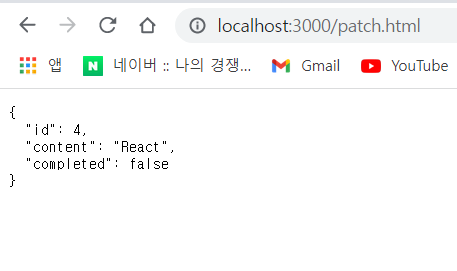</img><br/>
- db.json 파일

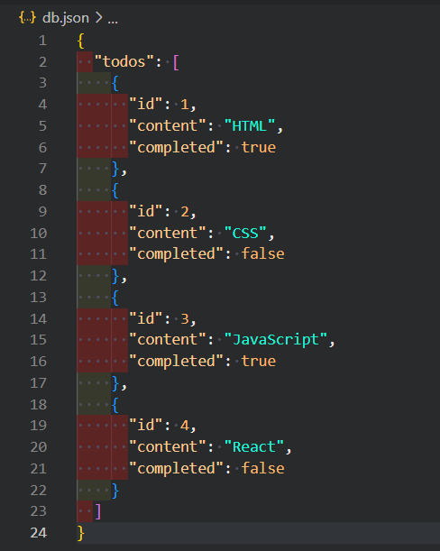</img><br/>


## 44.3.8 DELETE 요청
- 리소스 삭제할 때 사용하는 요청 메서드
```html
<!DOCTYPE html>
<html lang="en">
<head>
    <meta charset="UTF-8">
    <meta http-equiv="X-UA-Compatible" content="IE=edge">
    <meta name="viewport" content="width=device-width, initial-scale=1.0">
    <title>Document</title>
</head>
<body>
    <pre></pre>
    <script>
        // XMLHttpRequest 생성
        const xhr =  new XMLHttpRequest();

        // HTTP 요청 초기화
        // todos 리소스에서 id를 사용하여 todo를 삭제한다
        xhr.open('DELETE', '/todos/4');

        // HTTP 요청 전송
        xhr.send();

        // load 이벤트는 요청이 성공적으로 완료된 경우 발생한다. 
        xhr.onload = () => {
            // status 프로퍼티 값이 200이면 정상적으로 응답된 상태
            if(xhr.status === 200) {
                document.querySelector('pre').textContent = xhr.response;
            } else {
                console.log('Error', xhr.status, xhr.statusText);
            }
        };
    </script>
</body>
</html>
```
- http://localhost:3000/patch.html 로 접속

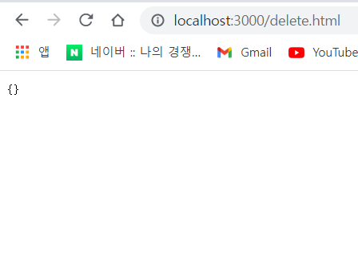</img><br/>

- db.json 파일

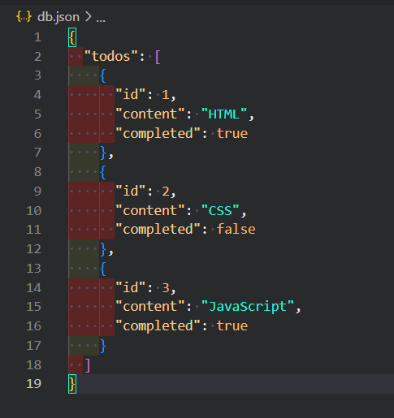</img><br/>


